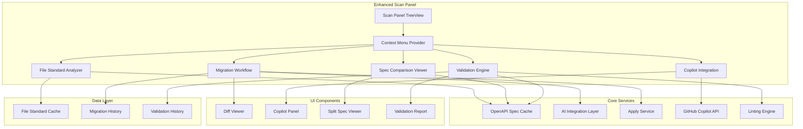

# Design Document

## Overview

The Enhanced Scan Context Menu extends the existing L1X ElavonX Migrator with intelligent file analysis and migration capabilities accessible directly from scan results. The design introduces 5 new context menu actions that provide automated file standard detection, streamlined migration workflows, GitHub Copilot integration, OpenAPI specification comparison, and compliance validation. The architecture emphasizes performance, user experience, and seamless integration with existing scan panel functionality.

## Architecture

### High-Level Architecture



### Context Menu Integration

The enhanced context menu integrates with the existing scan panel's TreeDataProvider through a new `ContextMenuProvider` that:

1. **Dynamic Menu Generation**: Builds context-aware menus based on file state, detection results, and available services
2. **State Management**: Tracks operation progress and caches results for performance
3. **Service Orchestration**: Coordinates between multiple services for complex workflows
4. **User Experience**: Provides consistent feedback and error handling across all operations

## Components and Interfaces

### 1. File Standard Analyzer

**Purpose**: Automatically detect whether files follow Converge, Elavon, or mixed standards using OpenAPI spec comparison.

**Interface**:
```typescript
interface IFileStandardAnalyzer {
  detectStandard(filePath: string): Promise<StandardDetectionResult>
  getCachedResult(filePath: string): StandardDetectionResult | null
  invalidateCache(filePath: string): void
  batchDetect(filePaths: string[]): Promise<Map<string, StandardDetectionResult>>
}

interface StandardDetectionResult {
  filePath: string
  standard: 'converge' | 'elavon' | 'mixed' | 'unknown'
  confidence: number
  details: StandardDetails
  timestamp: Date
  cacheValid: boolean
}

interface StandardDetails {
  convergePercentage: number
  elavonPercentage: number
  detectedEndpoints: DetectedEndpoint[]
  mixedIndicators?: MixedStandardIndicator[]
  analysisMethod: 'regex' | 'ast' | 'hybrid'
}

interface DetectedEndpoint {
  name: string
  standard: 'converge' | 'elavon'
  confidence: number
  lineNumber: number
  snippet: string
}
```

**Implementation Strategy**:
- **Pattern Matching**: Uses regex patterns for quick initial detection
- **AST Analysis**: Performs deeper analysis for ambiguous cases
- **Spec Comparison**: Compares detected patterns against loaded OpenAPI specs
- **Caching**: Implements file modification-based cache invalidation
- **Batch Processing**: Supports multi-file analysis for performance

### 2. Migration Workflow Service

**Purpose**: Orchestrate the complete migration process from Converge to Elavon using GitHub Copilot with backup and rollback capabilities.

**Interface**:
```typescript
interface IMigrationWorkflow {
  migrateFile(request: MigrationRequest): Promise<MigrationResult>
  previewMigration(filePath: string): Promise<MigrationPreview>
  applyMigration(migrationId: string, approved: boolean): Promise<ApplyResult>
  rollbackMigration(migrationId: string): Promise<RollbackResult>
  getMigrationHistory(filePath: string): Promise<MigrationHistoryEntry[]>
}

interface MigrationRequest {
  filePath: string
  sourceStandard: 'converge' | 'elavon'
  targetStandard: 'converge' | 'elavon'
  language: string
  framework?: string
  preserveComments: boolean
  backupOriginal: boolean
}

interface MigrationResult {
  migrationId: string
  success: boolean
  originalContent: string
  migratedContent: string
  backupPath: string
  aiExplanation: string
  confidence: number
  warnings: string[]
  appliedAt?: Date
}

interface MigrationPreview {
  migrationId: string
  diff: DiffResult
  explanation: string
  estimatedChanges: number
  riskAssessment: 'low' | 'medium' | 'high'
  requiredManualReview: string[]
}
```

**Implementation Strategy**:
- **Context Building**: Automatically identifies language, framework, and relevant context
- **Spec Loading**: Dynamically loads appropriate OpenAPI specs based on detected standards
- **Copilot Integration**: Constructs structured prompts with full context for optimal results
- **Backup Management**: Creates automatic backups with rollback capability
- **Diff Generation**: Uses Monaco editor's diff service for visual comparison
- **State Tracking**: Maintains migration history and status for audit trails

### 3. Copilot Integration Service

**Purpose**: Provide flexible GitHub Copilot integration with customizable prompts and conversation management.

**Interface**:
```typescript
interface ICopilotIntegration {
  createMigrationPrompt(context: FileContext): Promise<CopilotPrompt>
  sendCustomPrompt(prompt: CopilotPrompt): Promise<CopilotResponse>
  continueConversation(conversationId: string, followUp: string): Promise<CopilotResponse>
  getConversationHistory(filePath: string): Promise<CopilotConversation[]>
  isAvailable(): Promise<boolean>
}

interface FileContext {
  filePath: string
  content: string
  detectedStandard: StandardDetectionResult
  relevantSpecs: OpenApiSpecSection[]
  language: string
  framework?: string
}

interface CopilotPrompt {
  id: string
  template: string
  context: FileContext
  customInstructions?: string
  includeSpecs: boolean
  conversationId?: string
}

interface CopilotResponse {
  id: string
  content: string
  suggestions: CodeSuggestion[]
  explanation: string
  confidence: number
  followUpQuestions: string[]
  conversationId: string
}

interface CodeSuggestion {
  description: string
  code: string
  startLine: number
  endLine: number
  type: 'replacement' | 'insertion' | 'deletion'
}
```

**Implementation Strategy**:
- **Template System**: Pre-built prompt templates with context injection
- **Conversation Management**: Maintains conversation state for follow-up questions
- **Context Optimization**: Intelligently includes relevant spec sections without overwhelming the prompt
- **Response Processing**: Parses Copilot responses into actionable code suggestions
- **Integration Points**: Seamlessly connects with existing diff viewer and apply workflows

### 4. Spec Comparison Viewer

**Purpose**: Provide side-by-side OpenAPI specification comparison with intelligent highlighting and navigation.

**Interface**:
```typescript
interface ISpecComparisonViewer {
  openComparison(filePath: string): Promise<ComparisonView>
  highlightRelevantSections(endpoints: DetectedEndpoint[]): void
  showFieldMappings(sourceField: string, targetField: string): void
  exportComparison(format: 'json' | 'markdown' | 'html'): Promise<string>
  getRelevantSections(filePath: string): Promise<SpecSection[]>
}

interface ComparisonView {
  id: string
  convergeSpec: OpenApiSpec
  elavonSpec: OpenApiSpec
  relevantSections: SpecSection[]
  fieldMappings: FieldMapping[]
  differences: SpecDifference[]
}

interface SpecSection {
  path: string
  title: string
  content: any
  relevanceScore: number
  relatedEndpoints: string[]
}

interface SpecDifference {
  type: 'added' | 'removed' | 'modified'
  path: string
  oldValue?: any
  newValue?: any
  description: string
  impact: 'breaking' | 'non-breaking' | 'enhancement'
}
```

**Implementation Strategy**:
- **Split-Pane Layout**: Uses VS Code's webview with synchronized scrolling
- **Relevance Filtering**: Highlights sections based on detected endpoints in the selected file
- **Diff Visualization**: Color-coded differences with detailed annotations
- **Performance Optimization**: Virtual scrolling and lazy loading for large specifications
- **Export Capabilities**: Multiple format support for documentation and sharing

### 5. Validation Engine

**Purpose**: Comprehensive validation of files against Elavon L1 standards with detailed reporting and fix suggestions.

**Interface**:
```typescript
interface IValidationEngine {
  validateFile(filePath: string): Promise<ValidationResult>
  validateBatch(filePaths: string[]): Promise<Map<string, ValidationResult>>
  getValidationRules(): Promise<ValidationRule[]>
  suggestFixes(violations: ValidationViolation[]): Promise<FixSuggestion[]>
  runLinting(filePath: string, language: string): Promise<LintResult>
}

interface ValidationResult {
  filePath: string
  isCompliant: boolean
  overallScore: number
  violations: ValidationViolation[]
  warnings: ValidationWarning[]
  lintResults?: LintResult
  validatedAt: Date
  validationDuration: number
}

interface ValidationViolation {
  id: string
  rule: string
  severity: 'error' | 'warning' | 'info'
  message: string
  lineNumber: number
  columnNumber: number
  snippet: string
  suggestedFix?: string
  category: 'schema' | 'semantic' | 'style' | 'security'
}

interface ValidationRule {
  id: string
  name: string
  description: string
  category: string
  severity: 'error' | 'warning' | 'info'
  pattern?: string
  schemaPath?: string
  customValidator?: string
}

interface FixSuggestion {
  violationId: string
  description: string
  autoFixAvailable: boolean
  fixCode?: string
  manualSteps?: string[]
  confidence: number
}
```

**Implementation Strategy**:
- **Multi-Layer Validation**: Schema compliance, semantic correctness, and style checking
- **Rule Engine**: Configurable validation rules with custom validators
- **Language-Specific Linting**: Integration with existing linters (ESLint, TSLint, etc.)
- **Fix Suggestions**: Automated fix generation where possible with manual guidance
- **Performance**: Incremental validation with caching for large files
- **Reporting**: Detailed reports with categorized issues and priority indicators

## Data Models

### Core Data Structures

```typescript
// Enhanced Scan Result with Context Menu State
interface EnhancedScanResult extends ScanResult {
  standardDetection?: StandardDetectionResult
  migrationHistory: MigrationHistoryEntry[]
  validationStatus?: ValidationResult
  contextMenuState: ContextMenuState
}

interface ContextMenuState {
  operationsInProgress: Set<string>
  cachedResults: Map<string, any>
  lastUpdated: Date
  availableOperations: ContextMenuOperation[]
}

interface ContextMenuOperation {
  id: string
  label: string
  icon: string
  enabled: boolean
  visible: boolean
  requiresSetup?: string[]
  tooltip?: string
}

// Migration History
interface MigrationHistoryEntry {
  id: string
  filePath: string
  timestamp: Date
  operation: 'migrate' | 'rollback' | 'preview'
  sourceStandard: string
  targetStandard: string
  success: boolean
  backupPath?: string
  aiProvider: string
  confidence: number
  userApproved: boolean
  rollbackAvailable: boolean
}

// Validation Cache
interface ValidationCache {
  filePath: string
  fileHash: string
  result: ValidationResult
  cachedAt: Date
  expiresAt: Date
}

// Copilot Conversation
interface CopilotConversation {
  id: string
  filePath: string
  startedAt: Date
  lastActivity: Date
  messages: CopilotMessage[]
  context: FileContext
  status: 'active' | 'completed' | 'abandoned'
}

interface CopilotMessage {
  id: string
  type: 'user' | 'assistant'
  content: string
  timestamp: Date
  suggestions?: CodeSuggestion[]
}
```

### State Management

**Context Menu State**: Managed per file in the scan results
- Operation progress tracking
- Cached results for performance
- Dynamic menu generation based on file state

**File Standard Cache**: Persistent cache with invalidation
- File modification tracking
- Confidence-based cache expiration
- Batch invalidation for workspace changes

**Migration History**: Comprehensive audit trail
- All migration attempts and results
- Rollback capability with backup references
- User approval tracking for compliance

## Error Handling

### Error Categories and Recovery Strategies

#### 1. File Standard Detection Errors
- **File Access Issues**: Graceful fallback to basic pattern matching
- **Spec Loading Failures**: Use cached specs or prompt for manual configuration
- **Analysis Timeouts**: Return partial results with confidence indicators

#### 2. Migration Workflow Errors
- **Copilot Unavailable**: Fallback to template-based migration or manual guidance
- **Backup Failures**: Prevent migration and show clear error messages
- **Apply Failures**: Automatic rollback with detailed error reporting

#### 3. Validation Engine Errors
- **Rule Loading Failures**: Use built-in rules with reduced functionality
- **Linter Integration Issues**: Continue with schema-only validation
- **Performance Issues**: Implement progressive validation with user feedback

#### 4. UI and Integration Errors
- **WebView Failures**: Fallback to native VS Code panels where possible
- **Context Menu Issues**: Disable problematic operations with explanatory tooltips
- **State Corruption**: Automatic state reset with user notification

### Error Recovery Mechanisms

```typescript
interface ErrorRecoveryStrategy {
  canRecover(error: ContextMenuError): boolean
  recover(error: ContextMenuError, context: OperationContext): Promise<RecoveryResult>
  getFallbackAction(operation: string): AlternativeAction[]
}

interface ContextMenuError extends Error {
  operation: string
  filePath: string
  category: 'detection' | 'migration' | 'validation' | 'ui'
  recoverable: boolean
  userAction?: string
}
```

## Testing Strategy

### Unit Testing
- **Service Layer**: Mock dependencies for isolated testing
- **Context Menu Logic**: Test dynamic menu generation and state management
- **Validation Rules**: Comprehensive rule testing with edge cases
- **Error Handling**: Verify recovery strategies and fallback behaviors

### Integration Testing
- **Copilot Integration**: Mock Copilot API with various response scenarios
- **File Operations**: Test backup, apply, and rollback workflows
- **Spec Loading**: Test with various OpenAPI specification formats
- **UI Integration**: Verify context menu integration with scan panel

### End-to-End Testing
- **Complete Workflows**: Test full migration and validation processes
- **Multi-File Operations**: Batch processing and performance testing
- **Error Scenarios**: Network failures, file permission issues, service unavailability
- **User Experience**: Accessibility, keyboard navigation, and responsive design

## Performance Considerations

### Context Menu Performance
- **Lazy Loading**: Load operation results only when menu is opened
- **Caching Strategy**: Intelligent caching with file modification tracking
- **Background Processing**: Pre-compute results for frequently accessed files
- **Menu Generation**: Sub-100ms menu display with progressive enhancement

### File Analysis Performance
- **Incremental Analysis**: Only analyze changed portions of files
- **Batch Operations**: Optimize multi-file processing with worker threads
- **Memory Management**: Stream processing for large files
- **Cache Optimization**: LRU eviction with size-based limits

### UI Responsiveness
- **Progressive Loading**: Show immediate feedback with progressive enhancement
- **Virtual Scrolling**: Handle large spec comparisons efficiently
- **Debounced Operations**: Prevent excessive API calls during user interaction
- **Background Tasks**: Keep UI responsive during long-running operations

## Security Considerations

### Data Protection
- **File Content**: Secure handling of source code during analysis and migration
- **API Communications**: Encrypted communication with external services
- **Cache Security**: Secure storage of cached results and sensitive data
- **Backup Management**: Encrypted backups with secure cleanup

### External Service Integration
- **Copilot Integration**: Secure API communication with data minimization
- **Consent Management**: Clear user consent for external data transmission
- **Data Redaction**: Remove sensitive information from external requests
- **Audit Trail**: Complete logging of external service interactions

### Access Control
- **File Permissions**: Respect file system permissions and workspace boundaries
- **Operation Authorization**: User confirmation for destructive operations
- **Service Availability**: Graceful degradation when services are unavailable
- **Configuration Security**: Secure storage of API keys and service configurations

## Integration with Existing Architecture

### Scan Panel Integration
- **TreeDataProvider Extension**: Enhance existing provider with context menu support
- **Result Enhancement**: Extend scan results with additional metadata
- **State Synchronization**: Keep context menu state in sync with scan results
- **Performance Impact**: Minimal impact on existing scan performance

### Service Layer Integration
- **Dependency Injection**: Register new services in existing DI container
- **Event System**: Use existing event system for cross-service communication
- **Configuration**: Extend existing configuration system for new settings
- **Logging**: Integrate with existing telemetry and audit systems

### UI Consistency
- **Design System**: Follow existing VS Code extension design patterns
- **Icon Usage**: Consistent icon usage with existing panels
- **Error Handling**: Use existing error notification patterns
- **Accessibility**: Maintain existing accessibility standards

This design provides a comprehensive foundation for implementing the enhanced scan context menu functionality while maintaining consistency with the existing L1X ElavonX Migrator architecture and ensuring optimal performance and user experience.