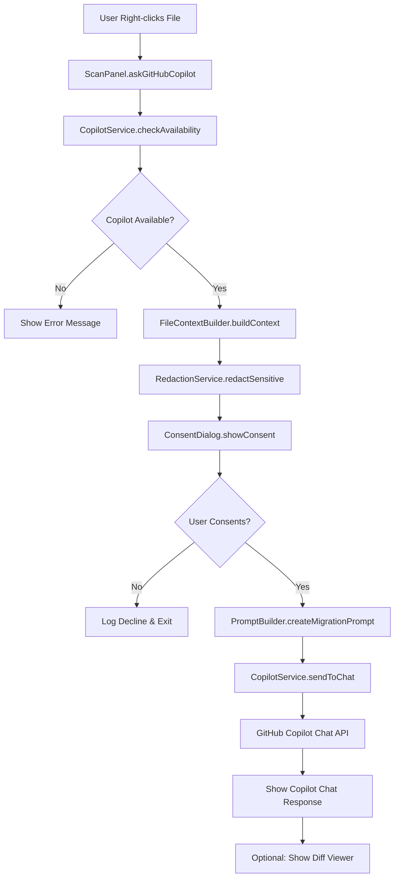

# Design Document

## Overview

This design document outlines the implementation of the GitHub Copilot integration feature for the L1X Migrator VS Code extension. The feature will replace the current placeholder message in the "Ask GitHub Copilot for Migration" context menu option with a fully functional integration that leverages GitHub Copilot Chat API to provide intelligent migration assistance from Converge API to Elavon L1 API.

The design follows the existing extension architecture, utilizing the established DI container pattern, service-oriented design, and consistent error handling approaches already implemented in the codebase.

## Architecture

### High-Level Architecture



### Service Layer Architecture

The implementation will follow the existing service-oriented architecture with these new services:

1. **CopilotService** - Main orchestration service for GitHub Copilot integration
2. **FileContextBuilder** - Builds comprehensive file context for migration prompts
3. **RedactionService** - Handles sensitive data redaction
4. **PromptBuilder** - Creates structured prompts for GitHub Copilot
5. **ConsentDialog** - Manages user consent for data sharing

## Components and Interfaces

### 1. CopilotService

**File**: `src/services/CopilotService.ts`

```typescript
export interface ICopilotService {
  checkAvailability(): Promise<boolean>;
  sendMigrationRequest(context: FileContext): Promise<CopilotResponse>;
  openChatWithPrompt(prompt: string): Promise<void>;
}

export class CopilotService implements ICopilotService {
  private readonly COPILOT_EXTENSION_ID = 'github.copilot-chat';
  
  async checkAvailability(): Promise<boolean> {
    // Check if GitHub Copilot extension is installed and active
    const extension = vscode.extensions.getExtension(this.COPILOT_EXTENSION_ID);
    return extension !== undefined && extension.isActive;
  }

  async sendMigrationRequest(context: FileContext): Promise<CopilotResponse> {
    // Build migration prompt and send to Copilot Chat
    const prompt = this.buildMigrationPrompt(context);
    return await this.invokeCopilotChat(prompt);
  }

  private async invokeCopilotChat(prompt: string): Promise<CopilotResponse> {
    // Use vscode.commands.executeCommand('github.copilot.chat.ask', prompt)
  }
}
```

### 2. FileContextBuilder

**File**: `src/services/FileContextBuilder.ts`

```typescript
export interface FileContext {
  filePath: string;
  fileName: string;
  language: string;
  content: string;
  detectedStandard?: StandardDetectionResult;
  relevantSpecs: OpenApiSpecSection[];
  fileSize: number;
  truncated: boolean;
}

export class FileContextBuilder {
  constructor(
    private fileStandardAnalyzer: FileStandardAnalyzer,
    private openApiService: OpenApiService
  ) {}

  async buildContext(filePath: string): Promise<FileContext> {
    const content = await this.readFileContent(filePath);
    const language = this.detectLanguage(filePath);
    const detectedStandard = await this.getStandardDetection(filePath);
    const relevantSpecs = await this.getRelevantSpecs(detectedStandard);
    
    return {
      filePath,
      fileName: path.basename(filePath),
      language,
      content: this.truncateIfNeeded(content),
      detectedStandard,
      relevantSpecs,
      fileSize: content.length,
      truncated: content.length > this.MAX_CONTENT_SIZE
    };
  }
}
```

### 3. RedactionService

**File**: `src/services/RedactionService.ts`

```typescript
export interface RedactionResult {
  redactedContent: string;
  redactionCount: number;
  redactedItems: RedactedItem[];
}

export interface RedactedItem {
  type: 'api_key' | 'token' | 'credential' | 'merchant_id';
  originalValue: string;
  redactedValue: string;
  lineNumber: number;
}

export class RedactionService {
  private readonly SENSITIVE_PATTERNS = [
    { type: 'api_key', pattern: /[A-Za-z0-9]{32,}/g, replacement: '[REDACTED_API_KEY]' },
    { type: 'token', pattern: /token["\s]*[:=]["\s]*[A-Za-z0-9_-]+/gi, replacement: 'token: "[REDACTED_TOKEN]"' },
    { type: 'merchant_id', pattern: /merchant[_-]?id["\s]*[:=]["\s]*[A-Za-z0-9]+/gi, replacement: 'merchant_id: "[REDACTED_MERCHANT_ID]"' }
  ];

  redactSensitiveData(content: string): RedactionResult {
    let redactedContent = content;
    const redactedItems: RedactedItem[] = [];
    let redactionCount = 0;

    this.SENSITIVE_PATTERNS.forEach(pattern => {
      redactedContent = redactedContent.replace(pattern.pattern, (match, offset) => {
        const lineNumber = this.getLineNumber(content, offset);
        redactedItems.push({
          type: pattern.type as any,
          originalValue: match,
          redactedValue: pattern.replacement,
          lineNumber
        });
        redactionCount++;
        return pattern.replacement;
      });
    });

    return { redactedContent, redactionCount, redactedItems };
  }
}
```

### 4. PromptBuilder

**File**: `src/services/PromptBuilder.ts`

```typescript
export class PromptBuilder {
  private readonly MIGRATION_TEMPLATE = `
# Converge to Elavon L1 Migration Request

## File Information
- **File**: {{filePath}}
- **Language**: {{language}}
- **Size**: {{fileSize}} bytes
{{#if detectedStandard}}
- **Detected Standard**: {{detectedStandard.standard}} ({{detectedStandard.confidence}}% confidence)
{{/if}}

## Current Code
\`\`\`{{language}}
{{content}}
\`\`\`

{{#if detectedEndpoints}}
## Detected API Patterns
{{#each detectedEndpoints}}
- {{name}} ({{standard}}, {{confidence}}% confidence)
{{/each}}
{{/if}}

{{#if relevantSpecs}}
## Relevant API Specifications
{{#each relevantSpecs}}
### {{title}}
\`\`\`json
{{content}}
\`\`\`
{{/each}}
{{/if}}

## Migration Request
Please help migrate this {{language}} code from Converge API to Elavon L1 API:

1. **Identify** all Converge API calls and patterns in the code
2. **Map** them to equivalent Elavon L1 endpoints and patterns
3. **Provide** specific code changes needed for the migration
4. **Explain** the key differences and any manual steps required
5. **Highlight** any potential issues or breaking changes

Please provide both the migrated code and a clear explanation of the changes made.
  `;

  createMigrationPrompt(context: FileContext): string {
    return this.renderTemplate(this.MIGRATION_TEMPLATE, context);
  }

  private renderTemplate(template: string, context: any): string {
    // Simple template rendering - replace {{variable}} with context values
    return template.replace(/\{\{(\w+(?:\.\w+)*)\}\}/g, (match, path) => {
      return this.getNestedValue(context, path) || match;
    });
  }
}
```

### 5. ConsentDialog

**File**: `src/ui/ConsentDialog.ts`

```typescript
export interface ConsentPayload {
  filePath: string;
  contentPreview: string;
  redactionSummary: RedactionResult;
  specSections: OpenApiSpecSection[];
}

export class ConsentDialog {
  static async showConsentDialog(payload: ConsentPayload): Promise<boolean> {
    const options = ['Share with GitHub Copilot', 'Cancel'];
    
    const message = `
L1X Migrator wants to share the following data with GitHub Copilot for migration assistance:

📁 File: ${payload.filePath}
🔒 Redacted items: ${payload.redactionSummary.redactionCount}
📊 API specs: ${payload.specSections.length} relevant sections

The data will be sent to GitHub Copilot to generate migration suggestions. 
Sensitive information has been automatically redacted.

Do you want to proceed?
    `;

    const choice = await vscode.window.showInformationMessage(
      message,
      { modal: true },
      ...options
    );

    return choice === options[0];
  }
}
```

### 6. OpenApiService

**File**: `src/services/OpenApiService.ts`

```typescript
export interface OpenApiSpecSection {
  title: string;
  path: string;
  content: any;
  relevanceScore: number;
}

export class OpenApiService {
  private convergeSpec: any = null;
  private elavonSpec: any = null;

  async loadSpecs(): Promise<void> {
    if (!this.convergeSpec) {
      this.convergeSpec = await this.loadSpecFile('openapi/Converge Open API.json');
    }
    if (!this.elavonSpec) {
      this.elavonSpec = await this.loadSpecFile('openapi/Elavon API Gateway Open API.json');
    }
  }

  async getRelevantSections(detectedStandard?: StandardDetectionResult): Promise<OpenApiSpecSection[]> {
    await this.loadSpecs();
    
    if (!detectedStandard?.details.detectedEndpoints) {
      return [];
    }

    const sections: OpenApiSpecSection[] = [];
    
    // Extract relevant sections based on detected endpoints
    for (const endpoint of detectedStandard.details.detectedEndpoints) {
      const convergeSection = this.findSpecSection(this.convergeSpec, endpoint.name);
      const elavonSection = this.findSpecSection(this.elavonSpec, endpoint.name);
      
      if (convergeSection) sections.push(convergeSection);
      if (elavonSection) sections.push(elavonSection);
    }

    return sections;
  }
}
```

## Data Models

### Enhanced Types

**File**: `src/types/copilot.ts`

```typescript
export interface CopilotResponse {
  success: boolean;
  conversationId?: string;
  error?: string;
}

export interface MigrationContext {
  fileContext: FileContext;
  redactionResult: RedactionResult;
  userConsent: boolean;
  timestamp: Date;
}

export interface CopilotTelemetry {
  operation: 'consent_shown' | 'consent_approved' | 'consent_declined' | 'prompt_sent' | 'response_received' | 'error';
  filePath: string;
  fileSize: number;
  language: string;
  redactionCount: number;
  detectedStandard?: string;
  confidence?: number;
  timestamp: Date;
  error?: string;
}
```

## Error Handling

### Error Categories and Responses

1. **GitHub Copilot Not Available**
   - Check: Extension not installed or not active
   - Response: "GitHub Copilot is not available. Please install and authenticate the GitHub Copilot extension."
   - Action: Provide link to Copilot installation guide

2. **File Access Errors**
   - Check: File not readable, too large, or binary
   - Response: "Unable to analyze file for migration. Please ensure the file is accessible and contains text content."
   - Action: Log error details, continue with basic context

3. **API Communication Errors**
   - Check: Copilot API timeout or failure
   - Response: "Failed to communicate with GitHub Copilot. Please try again."
   - Action: Implement retry logic with exponential backoff

4. **Context Building Errors**
   - Check: Standard detection or spec loading failures
   - Response: "Migration context could not be fully built. Proceeding with available information."
   - Action: Continue with partial context, warn user

### Error Recovery Strategy

```typescript
export class CopilotErrorHandler {
  static async handleError(error: Error, context: MigrationContext): Promise<void> {
    Logger.error('Copilot integration error', error);
    
    switch (error.name) {
      case 'CopilotNotAvailableError':
        await this.showCopilotInstallationGuidance();
        break;
      case 'FileAccessError':
        await this.showFileAccessError(context.fileContext.filePath);
        break;
      case 'ApiTimeoutError':
        await this.showRetryOption(context);
        break;
      default:
        await this.showGenericError(error.message);
    }
  }
}
```

## Testing Strategy

### Unit Tests

1. **CopilotService Tests**
   - Test availability checking
   - Mock Copilot API responses
   - Test error handling scenarios

2. **FileContextBuilder Tests**
   - Test context building with various file types
   - Test content truncation logic
   - Test integration with FileStandardAnalyzer

3. **RedactionService Tests**
   - Test pattern matching for sensitive data
   - Test redaction accuracy
   - Test edge cases and false positives

4. **PromptBuilder Tests**
   - Test template rendering
   - Test context variable substitution
   - Test prompt structure and formatting

### Integration Tests

1. **End-to-End Workflow Tests**
   - Test complete flow from context menu to Copilot response
   - Test user consent flow
   - Test error scenarios and recovery

2. **Service Integration Tests**
   - Test service dependencies and DI container
   - Test data flow between services
   - Test caching and performance

### Mock Strategy

```typescript
// Mock GitHub Copilot extension for testing
export class MockCopilotExtension {
  static mockAvailable(): void {
    jest.spyOn(vscode.extensions, 'getExtension').mockReturnValue({
      isActive: true,
      id: 'github.copilot-chat'
    } as any);
  }

  static mockUnavailable(): void {
    jest.spyOn(vscode.extensions, 'getExtension').mockReturnValue(undefined);
  }

  static mockChatResponse(response: string): void {
    jest.spyOn(vscode.commands, 'executeCommand').mockResolvedValue(response);
  }
}
```

## Performance Considerations

### Optimization Strategies

1. **Lazy Loading**
   - Load OpenAPI specs only when needed
   - Cache specs in memory after first load
   - Defer heavy processing until user consent

2. **Content Truncation**
   - Limit file content to 100KB for context building
   - Prioritize API-related code sections
   - Provide user feedback when content is truncated

3. **Caching Strategy**
   - Reuse existing FileStandardAnalyzer cache
   - Cache OpenAPI spec sections by endpoint
   - Implement TTL for cached data

4. **Async Processing**
   - Use progress indicators for long operations
   - Allow cancellation of in-progress operations
   - Process context building in background

### Performance Metrics

- Context building: < 5 seconds for typical files
- Redaction processing: < 1 second for most files
- Consent dialog response: Immediate
- Copilot API response: 10-30 seconds (external dependency)

## Security Considerations

### Data Protection

1. **Sensitive Data Redaction**
   - Automatic detection and redaction of API keys, tokens, credentials
   - User review of redacted content before sharing
   - Configurable redaction patterns

2. **User Consent**
   - Clear explanation of data being shared
   - Opt-in consent for each request
   - Session-based consent memory

3. **Data Minimization**
   - Send only necessary context to Copilot
   - Truncate large files to essential sections
   - Exclude binary or non-code content

### Privacy Compliance

- Log user consent decisions for audit
- Provide clear data usage explanations
- Allow users to opt-out of telemetry
- Follow VS Code extension privacy guidelines

## Integration Points

### Existing Extension Integration

1. **ScanPanel Integration**
   - Replace placeholder in `askGitHubCopilot` method
   - Maintain existing context menu structure
   - Use existing ScanTreeItem interface

2. **Service Registration**
   - Register new services in DI container
   - Follow existing service token pattern
   - Maintain singleton service instances

3. **Configuration Integration**
   - Use existing configuration patterns
   - Add new settings to package.json
   - Leverage existing settings management

4. **Logging Integration**
   - Use existing Logger utility
   - Follow established logging patterns
   - Add telemetry for feature usage

### External Dependencies

1. **GitHub Copilot Extension**
   - Dependency: `github.copilot-chat` extension
   - API: `vscode.commands.executeCommand('github.copilot.chat.ask')`
   - Fallback: Graceful degradation when unavailable

2. **VS Code APIs**
   - File system access for reading files and specs
   - Extension management for Copilot availability
   - Command execution for Copilot integration
   - UI components for consent and progress

This design provides a comprehensive, secure, and performant implementation of the GitHub Copilot integration while maintaining consistency with the existing extension architecture and patterns.