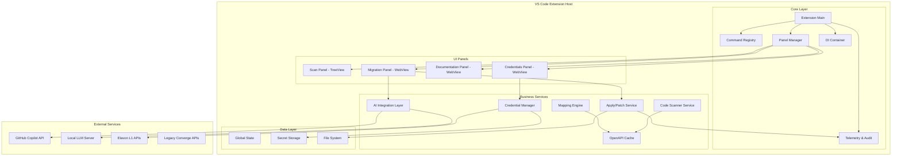
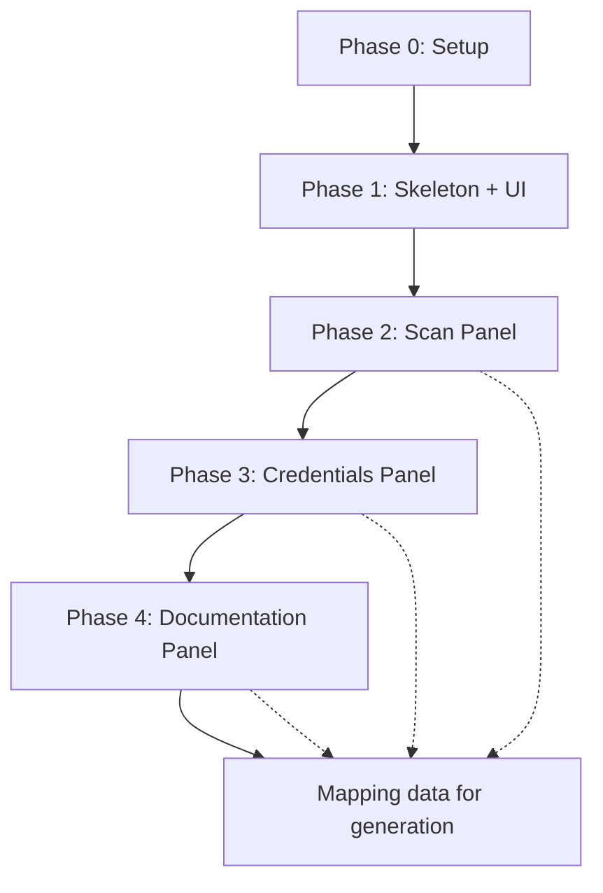

# Design Document

## Overview

The L1X ElavonX Migrator is a VS Code extension that facilitates the migration of legacy Converge API integrations to modern Elavon L1 APIs. The extension follows a modular, phase-based architecture where each phase delivers independently functional capabilities. The design emphasizes security, performance, and user experience through a panel-based interface with AI-assisted code transformation capabilities.

## Architecture

### High-Level Architecture



### Extension Activation & Lifecycle

The extension follows VS Code's standard activation pattern with multiple activation events:
- `onStartupFinished` - Background activation for performance
- `onView:l1x.*` - Panel-specific activation
- `onCommand:l1x.*` - Command-driven activation

### Dependency Injection Container

A centralized DI container manages service instances and their dependencies, enabling:
- Testable service isolation
- Configuration-driven service selection
- Lifecycle management
- Mock service injection for testing

## Components and Interfaces

### Core Services

#### 1. Code Scanner Service

**Purpose**: Discover and analyze Converge API integration points across multiple programming languages.

**Interface**:
```typescript
interface ICodeScannerService {
  scanProject(options: ScanOptions): Promise<ScanResult[]>
  cancelScan(): void
  getScanProgress(): ScanProgress
  addToIgnoreList(pattern: string): void
  getIgnoreList(): string[]
}

interface ScanOptions {
  mode: 'business-logic' | 'quick'
  languages: string[]
  excludePatterns: string[]
  includePatterns: string[]
}

interface ScanResult {
  id: string
  filePath: string
  line: number
  snippet: string
  matchedText: string
  confidence: number
  endpointType: string
  language: string
}
```

**Implementation Strategy**:
- **Phase 0**: Mock implementation returning sample data
- **Phase 1**: Full regex + AST parsing with progress tracking
- Uses worker threads for non-blocking scanning
- Implements cancellation tokens for user-initiated stops
- Caches results with file modification tracking

#### 2. Mapping Engine

**Purpose**: Generate and manage field mappings between Converge and Elavon L1 API schemas.

**Interface**:
```typescript
interface IMappingEngine {
  loadOpenApiSpec(spec: OpenApiSpec, type: 'converge' | 'l1'): Promise<void>
  generateAutoMapping(sourceEndpoint: string, targetEndpoint: string): Promise<EndpointMapping>
  applyManualOverride(mapping: FieldMapping): void
  exportMappings(format: 'json' | 'markdown'): string
  getMappingConfidence(mapping: EndpointMapping): number
}

interface EndpointMapping {
  id: string
  sourceOperation: string
  l1Operation: string
  fieldMappings: FieldMapping[]
  confidence: number
  overrides: FieldMapping[]
}

interface FieldMapping {
  sourcePath: string
  targetPath: string
  sourceType: string
  targetType: string
  confidence: number
  rule?: string
  isManualOverride: boolean
}
```

**Implementation Strategy**:
- **Phase 0**: Mock mappings with static confidence scores
- **Phase 3**: Full OpenAPI parsing with similarity algorithms
- Uses Levenshtein distance and semantic analysis for field matching
- Supports JSONPath expressions for complex field references
- Persists overrides in workspace settings

#### 3. AI Integration Layer

**Purpose**: Provide unified interface to multiple AI backends for code generation.

**Interface**:
```typescript
interface IAIAdapter {
  generateCode(request: CodeGenerationRequest): Promise<CodeGenerationResponse>
  isAvailable(): Promise<boolean>
  requiresConsent(): boolean
  getConsentPayload(request: CodeGenerationRequest): ConsentPayload
}

interface CodeGenerationRequest {
  originalCode: string
  sourceMapping: EndpointMapping
  targetFramework: string
  language: string
  context: CodeContext
}

interface CodeGenerationResponse {
  generatedCode: string
  explanation: string
  confidence: number
  warnings: string[]
}
```

**Adapter Implementations**:
- **CopilotAdapter**: Integrates with GitHub Copilot API
- **LocalLLMAdapter**: Connects to local LLM servers (Ollama, etc.)
- **TemplateAdapter**: Rule-based code generation for offline scenarios

#### 4. Credential Manager

**Purpose**: Securely manage Elavon L1 API credentials with connectivity testing.

**Interface**:
```typescript
interface ICredentialManager {
  storeCredentials(env: Environment, creds: ApiCredentials): Promise<void>
  getCredentials(env: Environment): Promise<ApiCredentials | null>
  testConnection(env: Environment): Promise<ConnectionResult>
  exportCredentials(passphrase: string): Promise<string>
  importCredentials(bundle: string, passphrase: string): Promise<void>
  lockCredentials(): void
}

interface ApiCredentials {
  merchantId: string
  apiKey: string
  apiSecret: string
}

interface ConnectionResult {
  success: boolean
  latency: number
  error?: string
  tokenValid: boolean
}
```

**Security Features**:
- Uses VS Code SecretStorage API exclusively
- AES-256 encryption for export/import
- Auto-lock mechanism with configurable timeout
- Credential redaction in all logs and telemetry

### Panel Architecture

#### 1. Scan Panel (TreeDataProvider)

**Design Pattern**: Native VS Code TreeView with custom TreeDataProvider

**Features**:
- Hierarchical display: Endpoint → File → Occurrence
- Real-time progress indicators during scanning
- Context menu integration for file-level actions
- Virtualized rendering for large result sets
- Keyboard navigation and accessibility support

**Context Menu Actions**:
- Convert Converge → Elavon (Preview)
- Migrate to Elavon style (Apply)
- Migrate to Elavon using GitHub Copilot
- Analyze & Document (Deep-link to Documentation panel)

#### 2. Credentials Panel (WebView)

**Design Pattern**: React-based WebView with VS Code API integration

**UI Components**:
- Tabbed interface (UAT/Production environments)
- Masked input fields for sensitive data
- Connection status indicators with latency display
- Export/Import functionality with encryption
- Auto-lock countdown timer

**Security Considerations**:
- No credential data stored in WebView state
- All sensitive operations handled by extension host
- CSP headers prevent external resource loading
- Input sanitization and validation

#### 3. Documentation Panel (WebView)

**Design Pattern**: Split-pane WebView with synchronized scrolling

**Features**:
- Dual OpenAPI specification viewers
- Interactive field mapping with visual connectors
- Confidence scoring and manual override capabilities
- Export functionality for mapping configurations
- Search and filter capabilities within specifications

**Rendering Strategy**:
- Virtual scrolling for large specifications
- Lazy loading of specification sections
- Debounced search with highlighting
- Responsive layout for different panel sizes

#### 4. Migration Panel (WebView)

**Design Pattern**: Monaco Editor integration with diff view

**Components**:
- Monaco diff editor for code comparison
- AI explanation panel with transformation details
- Action buttons (Generate, Apply, Rollback)
- Review workflow with approval states
- Patch export functionality

**Code Generation Flow**:
1. User selects generation backend (Copilot/Local/Template)
2. System shows consent modal for external services
3. AI generates code with explanation
4. User reviews diff and approves/rejects
5. System applies changes atomically with audit trail

## Data Models

### Core Data Structures

```typescript
// Scan Results
interface ScanResult {
  id: string
  filePath: string
  line: number
  column: number
  snippet: string
  matchedText: string
  confidence: number
  endpointType: 'transaction' | 'payment' | 'refund' | 'auth'
  language: string
  framework?: string
  createdAt: Date
}

// API Mappings
interface EndpointMapping {
  id: string
  sourceOperation: string
  l1Operation: string
  fieldMappings: FieldMapping[]
  confidence: number
  overrides: FieldMapping[]
  createdAt: Date
  updatedAt: Date
}

interface FieldMapping {
  sourcePath: string
  targetPath: string
  sourceType: string
  targetType: string
  confidence: number
  rule?: 'exact-match' | 'type-coercion' | 'semantic-similarity'
  isManualOverride: boolean
  notes?: string
}

// Migration Audit
interface MigrationAudit {
  id: string
  timestamp: Date
  endpointId: string
  filePath: string
  originalCode: string
  migratedCode: string
  appliedBy: string
  aiBackend: string
  confidence: number
  rollbackBlob: string
  reviewState: 'pending' | 'approved' | 'rejected'
  reviewComments?: string
}

// Configuration
interface ExtensionConfig {
  offlineMode: boolean
  aiBackend: 'copilot' | 'local' | 'none'
  scanExcludePatterns: string[]
  credentialLockTimeout: number
  telemetryEnabled: boolean
  autoSaveInterval: number
}
```

### State Management

**Global State**: Managed through VS Code's `ExtensionContext.globalState`
- Scan results and filters
- Panel visibility states
- User preferences and settings
- Mapping configurations

**Secret Storage**: Managed through VS Code's `SecretStorage`
- API credentials (never in global state)
- Encryption keys for export/import
- Authentication tokens (temporary)

**File System State**: Workspace-specific files
- `.l1x/scan-cache.json` - Cached scan results
- `.l1x/mappings/` - Saved mapping configurations
- `.l1x/audit/` - Migration audit logs

## Error Handling

### Error Categories and Strategies

#### 1. Network Errors
- **Retry Logic**: Exponential backoff for transient failures
- **Offline Fallback**: Graceful degradation to cached data
- **User Feedback**: Clear error messages with suggested actions

#### 2. File System Errors
- **Permission Issues**: Fallback to read-only mode with user notification
- **Large Files**: Streaming processing with progress indicators
- **Encoding Issues**: Auto-detection with manual override options

#### 3. AI Service Errors
- **Service Unavailable**: Fallback to template-based generation
- **Rate Limiting**: Queue requests with user notification
- **Invalid Responses**: Validation with error reporting

#### 4. Security Errors
- **Credential Validation**: Clear feedback without exposing details
- **Encryption Failures**: Secure cleanup with user guidance
- **Permission Denied**: Graceful degradation with alternative flows

### Error Recovery Mechanisms

```typescript
interface ErrorRecoveryStrategy {
  canRecover(error: Error): boolean
  recover(error: Error, context: any): Promise<RecoveryResult>
  getAlternativeAction(error: Error): AlternativeAction[]
}

interface RecoveryResult {
  success: boolean
  message: string
  data?: any
}
```

## Testing Strategy

### Unit Testing
- **Service Layer**: Mock dependencies, test business logic
- **Utility Functions**: Pure function testing with edge cases
- **Data Models**: Validation and serialization testing

### Integration Testing
- **Panel Communication**: WebView ↔ Extension Host messaging
- **File System Operations**: Workspace manipulation scenarios
- **API Integration**: Mock external services with various response scenarios

### End-to-End Testing
- **Complete Workflows**: Scan → Map → Generate → Apply
- **Error Scenarios**: Network failures, invalid credentials, file conflicts
- **Performance Testing**: Large codebase scanning, memory usage

### Security Testing
- **Credential Handling**: Ensure no leakage in logs or state
- **Input Validation**: Prevent injection attacks in user inputs
- **Encryption**: Verify export/import security measures

## Performance Considerations

### Scanning Performance
- **Worker Threads**: Non-blocking file processing
- **Incremental Scanning**: Only scan modified files
- **Result Caching**: Persist results with file modification tracking
- **Memory Management**: Stream processing for large files

### UI Responsiveness
- **Virtual Scrolling**: Handle large result sets efficiently
- **Debounced Operations**: Prevent excessive API calls
- **Progressive Loading**: Load data as needed
- **Background Processing**: Keep UI responsive during operations

### Resource Management
- **Memory Limits**: Monitor and cleanup unused resources
- **File Handles**: Proper cleanup and resource disposal
- **Network Connections**: Connection pooling and timeout management
- **Cache Management**: LRU eviction for bounded memory usage

## Security Architecture

### Data Protection
- **Credential Storage**: VS Code SecretStorage only
- **Encryption**: AES-256 for export/import operations
- **Data Sanitization**: Remove sensitive data from logs and telemetry
- **Secure Communication**: TLS 1.2+ for all external communications

### Access Control
- **Workspace Isolation**: Extension data scoped to workspace
- **Permission Model**: Minimal required permissions
- **Audit Trail**: Complete logging of sensitive operations
- **User Consent**: Explicit approval for external AI services

### Threat Mitigation
- **Input Validation**: Sanitize all user inputs
- **Code Injection**: Prevent execution of untrusted code
- **Data Exfiltration**: Monitor and control external communications
- **Dependency Security**: Regular security audits of dependencies

## Phase-Specific Implementation Plan

### Phase 0: Project Setup & Infrastructure

**Goal**: Establish project foundation with build system, dependencies, and basic structure.

**Components**:
- Project scaffolding and configuration
- Build system (TypeScript, Webpack, ESLint)
- Package.json with all required dependencies
- Basic folder structure and entry points

**Deliverables**:
- `package.json` with extension manifest and dependencies
- `tsconfig.json` with strict TypeScript configuration
- `webpack.config.js` for bundling
- `src/extension.ts` entry point
- Basic folder structure: `src/`, `media/`, `webview/`
- README with installation and development instructions

**Dependencies**: None

**Acceptance Criteria**:
- Project compiles without errors (`npm run compile`)
- Extension can be packaged (`vsce package`)
- All linting passes (`npm run lint`)

---

### Phase 1: Extension Skeleton + Interactive UI

**Goal**: Working VS Code extension with all four panels and interactive buttons showing alerts.

**Components**:
- Extension activation and lifecycle management
- Activity bar container with L1X icon
- Four panel providers (Scan, Credentials, Documentation, Migration)
- Command registry with button handlers
- Basic DI container and logging infrastructure

**Deliverables**:
- **Extension Main** (`src/extension.ts`):
  - Extension activation with `onStartupFinished` and panel events
  - DI container initialization
  - Panel registration and command binding
- **Panel Providers**:
  - `src/panels/ScanPanel.ts` - TreeDataProvider with 4 clickable commands
  - `src/panels/CredentialsPanel.ts` - WebView with 4 buttons
  - `src/panels/DocsPanel.ts` - WebView with 3 buttons  
  - `src/panels/MigrationPanel.ts` - WebView with 3 buttons
- **Command Registry** (`src/commands/index.ts`):
  - All button commands showing `vscode.window.showInformationMessage`
  - Panel open commands
- **Infrastructure**:
  - `src/di/container.ts` - Basic dependency injection
  - `src/utils/logger.ts` - Console logging with `[L1X]` prefix
- **WebView HTML**:
  - `webview/credentials.html` - Basic form with buttons
  - `webview/docs.html` - Split-pane layout with buttons
  - `webview/migration.html` - Diff editor placeholder with buttons

**Dependencies**: Phase 0

**Acceptance Criteria**:
- L1X icon visible in Activity Bar
- All four panels open and display correctly
- Every button click shows VS Code notification alert
- Console logs show `l1x_activate` and `l1x_button_clicked:<name>` events
- Extension installs and activates in < 100ms

---

### Phase 2: Scan Panel + Code Discovery

**Goal**: Functional code scanning with file discovery, progress tracking, and context menus.

**Components**:
- Code scanner service with regex and AST parsing
- Progress tracking with cancellation support
- File context menu integration
- Scan result management and persistence

**Deliverables**:
- **Code Scanner Service** (`src/services/CodeScannerService.ts`):
  - Business-logic mode (regex + AST) and Quick mode (regex only)
  - Multi-language support (JS/TS, Java, C#, Python, PHP, Ruby, VB)
  - Progress tracking with `ScanProgress` interface
  - Cancellation token support
  - File exclusion patterns and ignore list management
- **Enhanced Scan Panel** (`src/panels/ScanPanel.ts`):
  - Hierarchical tree: Endpoint → File → Occurrence
  - Real-time progress indicators during scanning
  - Virtualized rendering for large result sets
  - Filter capabilities (language, endpoint type, confidence, text)
  - Context menu with 4 actions per file node
- **File Context Menu**:
  - "Convert Converge → Elavon (Preview)" - opens Migration panel
  - "Migrate to Elavon style" - direct apply flow
  - "Migrate to Elavon using GitHub Copilot" - consent modal + AI flow
  - "Analyze & Document" - deep-link to Documentation panel
- **Data Models** (`src/types/models.ts`):
  - `ScanResult`, `ScanOptions`, `ScanProgress` interfaces
  - Result serialization and caching logic
- **Utilities**:
  - `src/utils/fsx.ts` - File system operations
  - AST parsers for supported languages

**Dependencies**: Phase 1

**Acceptance Criteria**:
- Seeded repository scan finds ≥95% of known Converge API occurrences
- Progress indicator updates in real-time with cancel capability
- Context menu actions trigger appropriate panel navigation
- Scan results persist across VS Code sessions
- Large codebases (10k+ files) scan without blocking UI

---

### Phase 3: Credentials Panel + API Authentication

**Goal**: Secure credential management with connectivity testing and encrypted export/import.

**Components**:
- Credential manager with SecretStorage integration
- API connectivity testing with health checks
- Encrypted export/import functionality
- Auto-lock mechanism with configurable timeout

**Deliverables**:
- **Credential Manager** (`src/services/CredentialManager.ts`):
  - SecretStorage integration for secure credential storage
  - UAT and Production environment support
  - Connection testing with token fetch and health ping
  - AES-256 encrypted export/import with user passphrase
  - Auto-lock mechanism with configurable timeout
  - Audit logging (no secrets in logs)
- **Enhanced Credentials Panel**:
  - Tabbed interface for UAT/Production environments
  - Masked input fields for API Key and Secret
  - Real-time connection status with latency display
  - Export/Import buttons with file dialogs
  - Auto-lock countdown timer
  - Connection test results with actionable error messages
- **API Integration**:
  - Elavon L1 authentication flow implementation
  - Health endpoint connectivity testing
  - Token validation and refresh logic
- **Security Features**:
  - Input sanitization and validation
  - Credential redaction in all logs
  - Secure cleanup on extension deactivation

**Dependencies**: Phase 2

**Acceptance Criteria**:
- Valid credentials authenticate successfully within 3 seconds
- Invalid credentials show actionable error messages
- Export/import maintains credential integrity with encryption
- Auto-lock activates after configured timeout
- No credentials ever appear in logs or global state
- Connection status updates reflect real API health

---

### Phase 4: Documentation Panel + OpenAPI Mapping

**Goal**: Side-by-side OpenAPI specification viewer with automated field mapping and manual overrides.

**Components**:
- OpenAPI specification parser and cache
- Dual-pane specification viewer with synchronized scrolling
- Automated field mapping engine with confidence scoring
- Manual override system with persistence

**Deliverables**:
- **OpenAPI Cache** (`src/spec/OpenApiCache.ts`):
  - Specification loading from file/URL
  - Parsing and validation of OpenAPI 3.0+ specs
  - Caching with version tracking and updates
  - Support for both Converge and Elavon L1 specifications
- **Mapping Engine** (`src/services/MappingEngine.ts`):
  - Automated field mapping using similarity algorithms
  - Confidence scoring based on name similarity and type matching
  - Manual override system with persistence
  - Mapping export to JSON/Markdown formats
- **Enhanced Documentation Panel**:
  - Split-pane layout with Converge and L1 specifications
  - Interactive tree views with types, required flags, examples
  - Visual connectors between mapped fields
  - Hover highlighting and synchronized scrolling
  - Search and filter capabilities within specifications
  - Manual mapping override interface
- **Data Models**:
  - `EndpointMapping`, `FieldMapping` interfaces
  - Mapping confidence calculation algorithms
  - Override persistence in workspace settings
- **UI Components**:
  - Specification tree renderer with virtual scrolling
  - Mapping connector visualization
  - Override editor with validation

**Dependencies**: Phase 3

**Acceptance Criteria**:
- OpenAPI specifications load and render within 2 seconds for 5MB files
- Auto-mapping achieves ≥0.7 average confidence on sample specifications
- Manual overrides persist and update visual connectors immediately
- Export generates valid mapping.json consumed by Migration panel
- Search and filter operations complete within 100ms

---

### Phase 5: Migration Panel + AI Code Generation

**Goal**: AI-assisted code generation with Monaco diff editor, review workflows, and audit trails.

**Components**:
- AI integration layer with multiple backend support
- Monaco diff editor integration
- Code generation and application system
- Migration audit trail and rollback capabilities

**Deliverables**:
- **AI Integration Layer** (`src/services/AIAdapter.ts`):
  - Abstract adapter interface for multiple AI backends
  - GitHub Copilot adapter with consent management
  - Local LLM adapter for offline scenarios
  - Template-based adapter for fallback generation
- **AI Adapters**:
  - `src/services/adapters/CopilotAdapter.ts` - GitHub Copilot integration
  - `src/services/adapters/LocalLLMAdapter.ts` - Local LLM server connection
  - `src/services/adapters/TemplateAdapter.ts` - Rule-based generation
- **Apply/Patch Service** (`src/services/ApplyService.ts`):
  - Atomic code application with rollback capability
  - Git integration for signed commits
  - Patch generation and export functionality
  - Migration audit trail management
- **Enhanced Migration Panel**:
  - Monaco diff editor showing original vs generated code
  - AI explanation panel with transformation details
  - Backend selection (Copilot/Local/Template)
  - Consent modal for external AI services with payload preview
  - Review workflow with approve/reject/comment capabilities
  - Action buttons: Generate Preview, Apply, Rollback, Export Patch
- **Migration Audit** (`src/services/AuditService.ts`):
  - Complete audit trail for all applied migrations
  - Rollback blob storage for exact restoration
  - Review state tracking and comments
  - Audit log export functionality
- **Security & Consent**:
  - Consent payload generation with data redaction
  - Offline mode enforcement when configured
  - External service communication logging

**Dependencies**: Phase 4

**Acceptance Criteria**:
- Code generation completes within 30 seconds for typical files
- Monaco diff renders within 500ms for files up to 2k lines
- Apply operation creates atomic commits with rollback capability
- Rollback restores byte-identical original code
- Consent modal accurately lists all external data transmission
- Audit trail captures complete migration history
- All AI backends function according to configuration

---

## Implementation Dependencies & Sequencing



## Cross-Phase Integration Points

- **Scan → Migration**: Context menu actions trigger Migration panel with pre-populated file context
- **Credentials → Migration**: API credentials used for testing generated code against L1 endpoints
- **Documentation → Migration**: Field mappings provide context for AI code generation
- **All Panels → Audit**: Comprehensive logging and telemetry across all operations

This phased approach ensures each delivery is independently functional while building toward the complete migration solution.