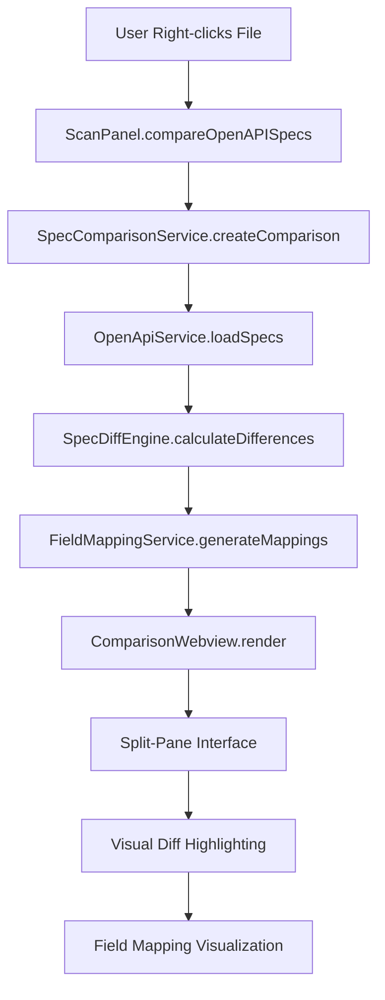

# Design Document

## Overview

This design document outlines the implementation of the OpenAPI Specification Comparison feature for the L1X Migrator VS Code extension. The feature will provide a comprehensive side-by-side comparison of Converge and Elavon L1 API specifications with visual diff highlighting, field mapping, and context-aware section highlighting.

## Architecture

### High-Level Architecture



## Components and Interfaces

### 1. SpecComparisonService

**File**: `src/services/SpecComparisonService.ts`

```typescript
export interface ISpecComparisonService {
  createComparison(filePath?: string): Promise<ComparisonView>;
  exportComparison(format: 'json' | 'markdown' | 'html'): Promise<string>;
  getRelevantSections(filePath: string): Promise<SpecSection[]>;
}

export class SpecComparisonService implements ISpecComparisonService {
  constructor(
    private openApiService: OpenApiService,
    private specDiffEngine: SpecDiffEngine,
    private fieldMappingService: FieldMappingService
  ) {}

  async createComparison(filePath?: string): Promise<ComparisonView> {
    const [convergeSpec, elavonSpec] = await Promise.all([
      this.openApiService.loadConvergeSpec(),
      this.openApiService.loadElavonSpec()
    ]);

    const differences = await this.specDiffEngine.calculateDifferences(convergeSpec, elavonSpec);
    const fieldMappings = await this.fieldMappingService.generateMappings(convergeSpec, elavonSpec);
    const relevantSections = filePath ? await this.getRelevantSections(filePath) : [];

    return {
      id: `comparison-${Date.now()}`,
      convergeSpec,
      elavonSpec,
      differences,
      fieldMappings,
      relevantSections
    };
  }
}
```### 2. S
pecDiffEngine

**File**: `src/services/SpecDiffEngine.ts`

```typescript
export class SpecDiffEngine {
  calculateDifferences(spec1: OpenApiSpec, spec2: OpenApiSpec): SpecDifference[] {
    const differences: SpecDifference[] = [];
    
    // Compare paths
    this.comparePaths(spec1.paths, spec2.paths, differences);
    
    // Compare components
    this.compareComponents(spec1.components, spec2.components, differences);
    
    // Compare info and metadata
    this.compareMetadata(spec1.info, spec2.info, differences);
    
    return differences;
  }

  private comparePaths(paths1: any, paths2: any, differences: SpecDifference[]): void {
    // Implementation for path comparison
  }
}
```

### 3. ComparisonWebview

**File**: `src/ui/ComparisonWebview.ts`

```typescript
export class ComparisonWebview {
  private panel: vscode.WebviewPanel | undefined;

  async show(comparison: ComparisonView): Promise<void> {
    this.panel = vscode.window.createWebviewPanel(
      'specComparison',
      'API Specification Comparison',
      vscode.ViewColumn.One,
      {
        enableScripts: true,
        retainContextWhenHidden: true
      }
    );

    this.panel.webview.html = this.getWebviewContent(comparison);
    this.setupMessageHandling();
  }

  private getWebviewContent(comparison: ComparisonView): string {
    return `
    <!DOCTYPE html>
    <html>
    <head>
        <meta charset="UTF-8">
        <title>API Specification Comparison</title>
        <style>${this.getStyles()}</style>
    </head>
    <body>
        <div class="comparison-container">
            <div class="spec-pane converge-pane">
                <h2>Converge API</h2>
                <div class="spec-content" id="converge-content"></div>
            </div>
            <div class="spec-pane elavon-pane">
                <h2>Elavon L1 API</h2>
                <div class="spec-content" id="elavon-content"></div>
            </div>
        </div>
        <script>${this.getScript(comparison)}</script>
    </body>
    </html>`;
  }
}
```