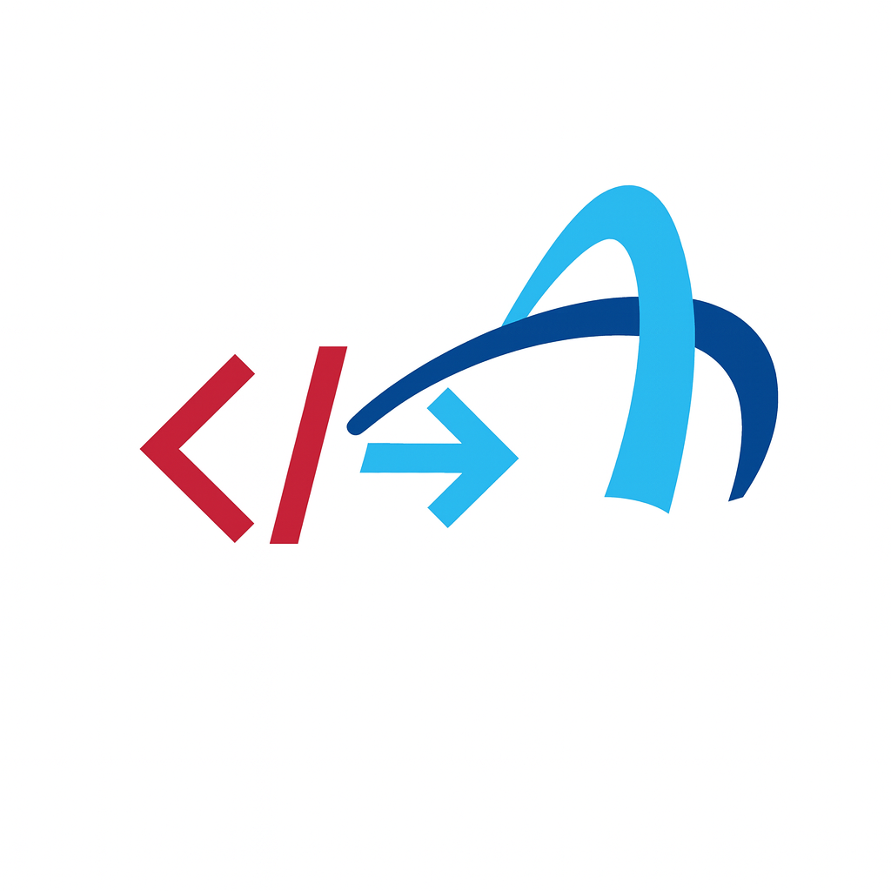

# L1X ElavonX Migrator

<div align="center">



**A Professional VS Code Extension for Migrating Legacy Converge API Integrations to Modern Elavon L1 APIs**

[](https://github.com/dvnharish/Elavon-Plugin-L1x)
[](LICENSE)
[](https://code.visualstudio.com/)
[](https://www.typescriptlang.org/)

</div>

## 🚀 Overview

The L1X ElavonX Migrator is a comprehensive VS Code extension that streamlines the migration process from legacy Converge API integrations to modern Elavon L1 APIs. Built with a phase-wise development approach, it provides developers with powerful tools for code discovery, credential management, API documentation comparison, and AI-assisted code transformation.

## ✨ Features

### 🔍 **Project Scan Panel**
- **Multi-language Support**: Discover Converge API integrations across JS/TS, Java, C#, Python, PHP, Ruby, and VB
- **Hierarchical Tree View**: Organized by Endpoint → File → Occurrence
- **Real-time Progress**: Live progress indicators with cancellation support
- **Context Menu Actions**: Right-click to initiate migrations directly from scan results

### 🔑 **Credentials Panel**
- **Multiple Credential Sets**: Support for multiple named credential sets per environment
- **Environment URLs**: Display UAT and Production API endpoints with visual indicators
- **Editable Fields**: Fully editable credential names, Merchant ID, API Key, and API Secret
- **Real-time Testing**: Test individual credential sets with visual status indicators (green/red)
- **Context Menu**: Right-click on credential sets for quick test access
- **Add/Remove**: Plus buttons to add new credential sets, delete functionality
- **Export/Import**: Backup and restore credential configurations
- **Connection Validation**: Actual API endpoint testing with response time measurement

### 📚 **Documentation Panel**
- **OpenAPI Integration**: Load and compare Converge and Elavon L1 specifications
- **Field Mapping**: Automated field mapping with confidence scoring
- **Tree Structure**: Professional tree view of API endpoints and fields
- **Export Capabilities**: Generate mapping configurations for migration use

### 🚀 **Migration Panel**
- **Workflow Management**: Track migrations through Pending → Generated → Applied → Audit states
- **AI Integration**: Support for GitHub Copilot, Local LLM, and template-based generation
- **Status Tracking**: Visual status indicators with colored icons
- **Audit Trail**: Complete migration history with rollback capabilities

## 🏗️ Architecture

### Phase-Based Development
The extension follows a structured phase-based approach:

- **Phase 0**: Project Setup & Infrastructure ✅
- **Phase 1**: Extension Skeleton + Interactive UI ✅
- **Phase 2**: Scan Panel + Code Discovery (In Development)
- **Phase 3**: Credentials Panel + API Authentication
- **Phase 4**: Documentation Panel + OpenAPI Mapping
- **Phase 5**: Migration Panel + AI Code Generation

### Technical Stack
- **Frontend**: Native VS Code TreeDataProvider APIs
- **Backend**: TypeScript with strict configuration
- **Build System**: Webpack with production optimization
- **Testing**: Jest with comprehensive test coverage (24/24 tests passing)
- **Code Quality**: ESLint with TypeScript rules

## 📋 Requirements

### System Requirements
- **VS Code**: Version 1.74.0 or higher
- **Node.js**: Version 16.x or higher
- **Operating System**: Windows, macOS, or Linux

### Development Requirements
- **TypeScript**: 4.9+
- **Webpack**: 5.75+
- **Jest**: 29.3+
- **ESLint**: 8.28+

## 🛠️ Installation

### From Release (Recommended)
1. Download the latest `.vsix` file from [Releases](https://github.com/dvnharish/Elavon-Plugin-L1x/releases)
2. Open VS Code
3. Go to Extensions view (`Ctrl+Shift+X`)
4. Click "..." menu → "Install from VSIX..."
5. Select the downloaded `.vsix` file

### From Source
```bash
# Clone the repository
git clone https://github.com/dvnharish/Elavon-Plugin-L1x.git
cd Elavon-Plugin-L1x

# Install dependencies
npm install

# Compile the extension
npm run compile

# Package the extension
npm run package

# Install the generated .vsix file in VS Code
code --install-extension l1x-elavonx-migrator-0.1.0.vsix
```

## 🎯 Usage

### Getting Started
1. **Open VS Code** and look for the L1X icon in the Activity Bar
2. **Click the L1X icon** to reveal the four main panels
3. **Explore each panel** to understand the migration workflow

### Workflow
1. **Scan Project**: Use the Project Scan panel to discover Converge API usage
2. **Manage Credentials**: Set up your Elavon L1 API credentials securely
3. **Load Documentation**: Import OpenAPI specifications for comparison
4. **Execute Migration**: Generate and apply code transformations

### Panel Overview

#### 🔍 Project Scan
- Click toolbar buttons to scan your codebase
- Expand tree nodes to see detailed occurrences
- Right-click files for migration options

#### 🔑 Credentials
- Add credentials using the "+" button
- Test connections with the plug icon
- Manage separate UAT and Production environments

#### 📚 Documentation
- Load OpenAPI specs with "Add Spec"
- Compare specifications side-by-side
- Generate field mappings automatically

#### 🚀 Migration
- View pending migrations in tree format
- Generate previews with AI assistance
- Track applied migrations and audit history

## 🧪 Development

### Development Scripts
```bash
# Development
npm run compile          # Compile TypeScript
npm run watch           # Watch for changes and compile
npm run lint            # Run ESLint
npm run test            # Run Jest tests

# Production
npm run package         # Package for production
vsce package           # Create .vsix file
```

### Testing
The extension includes comprehensive test coverage:
- **Unit Tests**: 24 passing tests
- **Integration Tests**: Panel communication testing
- **Mock Framework**: Complete VS Code API mocking

```bash
npm test                # Run all tests
npm run test:watch      # Run tests in watch mode
```

### Project Structure
```
├── src/
│   ├── panels/         # Tree-based UI panels
│   ├── commands/       # Command registry and handlers
│   ├── di/            # Dependency injection container
│   ├── utils/         # Utilities and logger
│   └── test/          # Test utilities and mocks
├── webview/           # Legacy HTML files (Phase 1 only)
├── media/             # Extension icons and assets
├── openapi/           # Sample OpenAPI specifications
└── .kiro/specs/       # Design specifications
```

## 📖 Design & Requirements

### Requirements Overview
The extension addresses the need for systematic migration from Converge APIs to Elavon L1 APIs through:

- **Automated Discovery**: Find all Converge API usage across codebases
- **Secure Credential Management**: Handle API keys and secrets safely
- **Documentation Comparison**: Side-by-side API specification analysis
- **AI-Assisted Migration**: Intelligent code transformation with human oversight

### Design Principles
- **Security First**: All credentials stored using VS Code's SecretStorage
- **Professional UI**: Native VS Code TreeDataProvider for consistent experience
- **Incremental Migration**: Phase-wise development for manageable complexity
- **Developer-Friendly**: Intuitive workflow matching developer expectations

### Task Management
The project follows a structured task-based approach with clear deliverables for each phase. See [tasks.md](.kiro/specs/l1x-elavonx-migrator/tasks.md) for detailed implementation tasks.

## 🤝 Contributing

We welcome contributions! Please follow these steps:

1. **Fork the repository**
2. **Create a feature branch**: `git checkout -b feature/amazing-feature`
3. **Make your changes** and add tests
4. **Run the test suite**: `npm test`
5. **Commit your changes**: `git commit -m 'Add amazing feature'`
6. **Push to the branch**: `git push origin feature/amazing-feature`
7. **Open a Pull Request**

### Development Guidelines
- Follow TypeScript strict mode requirements
- Maintain test coverage above 90%
- Use ESLint configuration for code style
- Add JSDoc comments for public APIs

## 📄 License

This project is licensed under the MIT License - see the [LICENSE](LICENSE) file for details.

## 🏢 About Elavon

Elavon is a leading payment processor providing innovative payment solutions for businesses worldwide. The L1X ElavonX Migrator extension is part of Elavon's commitment to helping developers seamlessly transition to modern payment APIs.

## 📞 Support

- **Issues**: [GitHub Issues](https://github.com/dvnharish/Elavon-Plugin-L1x/issues)
- **Documentation**: [Wiki](https://github.com/dvnharish/Elavon-Plugin-L1x/wiki)
- **Discussions**: [GitHub Discussions](https://github.com/dvnharish/Elavon-Plugin-L1x/discussions)

## 🎯 Roadmap

- [x] **Phase 1**: Professional UI with tree-based panels
- [ ] **Phase 2**: Real code scanning with AST parsing
- [ ] **Phase 3**: Complete credential management with API integration
- [ ] **Phase 4**: OpenAPI specification loading and field mapping
- [ ] **Phase 5**: AI-powered code generation and transformation

---

<div align="center">

**Built with ❤️ for the Developer Community**

[⭐ Star this repo](https://github.com/dvnharish/Elavon-Plugin-L1x) | [🐛 Report Bug](https://github.com/dvnharish/Elavon-Plugin-L1x/issues) | [💡 Request Feature](https://github.com/dvnharish/Elavon-Plugin-L1x/issues)

</div>